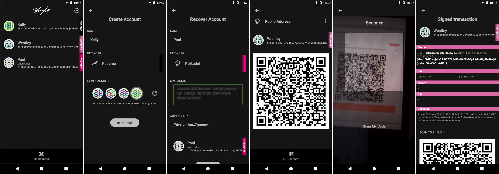

    

# Stylo - A wallet to keep you crypto funds offline

Stylo is a mobile application that turns any smartphone into an air-gapped crypto wallet. This is a fork of [Parity Signer](https://github.com/paritytech/parity-signer) and will work anywhere Signer works.

You can create an account for Polkadot, Kusama or any substrate based chain as well as Ethereum. You can sign transactions and messages, transfer funds to and from these accounts without any sort of connectivity enabled on the device.

You must turn off or even physically remove the smartphone's wifi, mobile network, and bluetooth to ensure that the mobile phone containing these accounts will not be exposed to any online threat.

**Disabling the mobile phone's networking abilities is a requirement for the app to be used as intended, visit our [wiki](./docs/wiki/Security-And-Privacy.md) for more details.**

Have a look at the tutorial to learn how to use [Stylo together with Polkadot-js apps](./docs/tutorials/Kusama-tutorial.md),  or [MyCrypto app](./docs/tutorials/MyCrypto-tutorial.md).

Any data transfer from or to the app happens using QR code. By doing so, the most sensitive piece of information, the private keys, will never leave the phone. The Stylo mobile app can be used to store any Polkadot or Ethereum account, this includes KSM, ETH, ETC.. It also supports various testnets (Westend, Kovan, Görli...).

    

## What's the difference between Stylo and Parity Signer

Stylo aims at creating a pleasing user experience for account creation and recovery. An account you create on Stylo can be recovered directly on Subkey or Polkadot.js/apps wihtout having to deal with account derivation. While the critical parts (key management and signing) are similar to what Parity Signer has as of v4.5.3, a significant part of the code base has been re-written to ease the maintainance.

### What Stylo brings compared to Signer:
- It is user friendly. E.g unless you are an advanced user, you will not have to deal with "derivation paths"
- Review what you are signing. This feature used to be part of Parity Signer but was removed starting with v4.2
- Choose your account based on the identicon
- Arbitrary message signing (allows participatin in crowdloans for network requiring you to sign terms and conditions)

## Getting Start

### Tutorials

- [Link Stylo and the Polkadot.js extension](./docs/tutorials/Crowdloan-tutorial.md)
- [Signing with Pokadot.js apps](./docs/tutorials/Kusama-tutorial.md)
- [Recover Account from Polkadot.js Apps](./docs/tutorials/Recover-Account-Polkadotjs.md)
- [Signing an Ethereum tx with MyCrypto](./docs/tutorials/MyCrypto-tutorial.md)
<!-- - [Update New Network](./docs/tutorials/New-Network.md)-->

### Wiki

- [Security and Privacy](./docs/wiki/Security-And-Privacy.md)
- [Development](./docs/wiki/Development.md)
- [Building and Publishing](./docs/wiki/Building-And-Publishing.md)
- [Testing](./docs/wiki/Test.md)
- [Troubleshooting](./docs/wiki/Troubleshooting.md)
- [QA Check List](./docs/wiki/QA.md)

## License

Stylo is [GPL 3.0 licensed](LICENSE).
