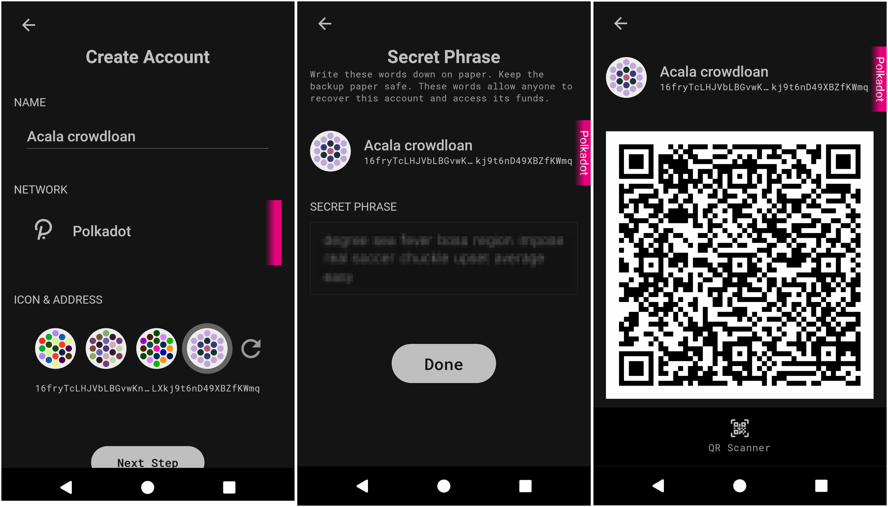
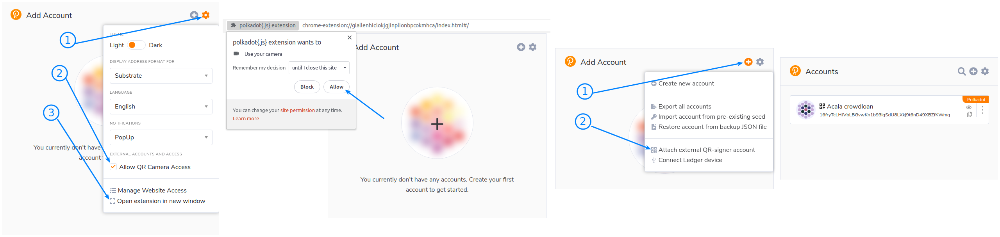
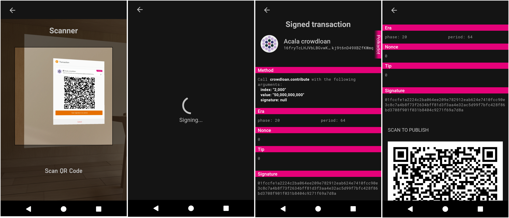

# Stylo tutorial with Polkadot-js extension to participate in a crowdloan

This tutorial will walk you through setting up a Polkadot account with the Stylo and then use this account together with [Polkadot-js extension](https://polkadot.js.org/extension/) to be able to participate in any parachain crowdloan.

## Summary
- [1. Get Stylo mobile application](#1-get-stylo-mobile-application)
- [2. Setup or recover an account](#2-setup-or-recover-an-account)
  - [Create an account](#create-an-account)
  - [Recover an account with your secret phrase](#recover-an-account-with-your-secret-phrase)
- [3. Add Stylo's account to Polkadot-js extension](#3-add-stylos-account-to-polkadot-js-extension)
- [4. Sign a message or a transaction](#4-sign-a-message-or-a-transaction)

## 1. Get Stylo mobile application

### Device security
Stylo is meant to be used offline. The mobile device used to run Stylo will hold valuable information that needs to be kept securely stored. It is therefore advised to:
- Get a Stylo dedicated mobile device.
- Make a factory reset.
- Enable full-disk encryption on the device, with a reasonable password (might not be on by default, for example for older Android devices).
- Do not use any biometrics such as fingerprint or face recognition for device decryption/unlocking, as those may be less secure than regular passwords.
- Once Stylo has been installed, enable airplane mode and make sure to switch off Wifi, Bluetooth or any connection ability of the device.
- Only charge the phone using a power outlet that is never connected to the internet. Only charge the phone with the manufacturer's charging adapter. Do not charge the phone on public USB chargers.

### Install Stylo mobile application

Install Stylo making sure that it originated from **Stylo app**
- Android: From the [Github releases page](https://github.com/stylo-app/stylo/releases) or [Android play store](https://play.google.com/store/apps/details?id=com.styloapp)
<!-- - [iOS](https://itunes.apple.com/us/app//id1218174838) -->

## 2. Setup or recover an account
When launching the app for the first time, the account list will be empty. At this stage, you will either want to create an account or recover an account previously created.
 
### Create an account
 
Tap on the `+` button, and follow along by choosing a name, the network (e.g Polkadot) and an icon for your account.

In the next step, your secret phrase will be presented to you. Think of it as a master key. If you lose it, you lose access to your money.
**Write this secret phrase down and store it in a safe place**.
If your phone gets stolen/broken/forgotten this will be the only way to [recover your account](#recover-an-account-with-your-secret-phrase).

You will then be asked to choose a pin code. This pin will be needed later on to unlock your account to manage the account or sign a transaction.
You have now created an account offline. If you select it, you will see its QR code that will allow you to link it to an online device such as a computer.

### Recover an account with your secret phrase

If you already have an account created with either Stylo or any other wallet, you can recover it by doing so:
- Tap on the `+` at the top right corner, and choose ` Recover account`.
- Input the new account name.
- Select the network.
- Type in the secret phrase, word suggestion helps you prevent any typo.
- In the advanced section you can add an optional derivation path.
- Tap `Recover account`.
- Select a PIN number and confirm it by typing it again.

## 3. Add Stylo's account to Polkadot-js extension

Polkadot-js extension allows you to see your Stylo account on your computer. The extension is the interface between your account offline, and any online web application. In this step we will install the Polkadot.js extension and link our Stylo account.

- Visit [Polkadot-js extension](https://polkadot.js.org/extension/) website and make sure to install the extension for your browser.
- Once it's installed, you'll need to allow access to your camera. To do so, click on the settings button, and check the "allow camera" checkbox
- You may need to open the extension in a new window to see the browser popup requesting your camera permission
- Once this is done, you can attach an external account via QR code.
- On Stylo, choose on the account you want to attach and show its QR code to your computer camera. Make sure the QR code is fully displayed on your mobile's screen.
- You can now name this account on Polkadot-js extension and add it.

## 4. Sign a message or a transaction

Assuming that your Stylo account now has funds, you will be able to participate in crowdloans or send some funds securely to anyone, without transferring your private key, and without needing any internet connection on the mobile phone where Stylo is installed.

- Any time you will need to sign a message or a transaction, the Polkadot-js extension will show you a QR code that represents the transaction.
- From the Stylo account overview, tap the "scan" button on the bottom and scan the QR code presented by the Polkadot-js extension.
- Tap your pin and be patient for Stylo to decode and sign the transaction, this may take up to a minute the first time.
- Review the transaction methods and the amount to send on your phone. The amount and addresses must match what you've entered in the app. If someone tries to hack you, this is where you can realize it and reject the transaction.

Your phone has now *signed the transaction offline* using your Stylo account private key. If you scroll down, the QR code that is now displayed on your phone represents a signed transaction that can be broadcasted. We will do this in the next steps:
- On Polkadot-js extension, click on `Scan Signature QR`, this will turn on your computer camera.
- Face your phone's display to your webcam for the extension to be able to read the signed transaction.
- Your transaction is sent automatically.
- Congrats you just signed a transaction from an air-gapped account :)

